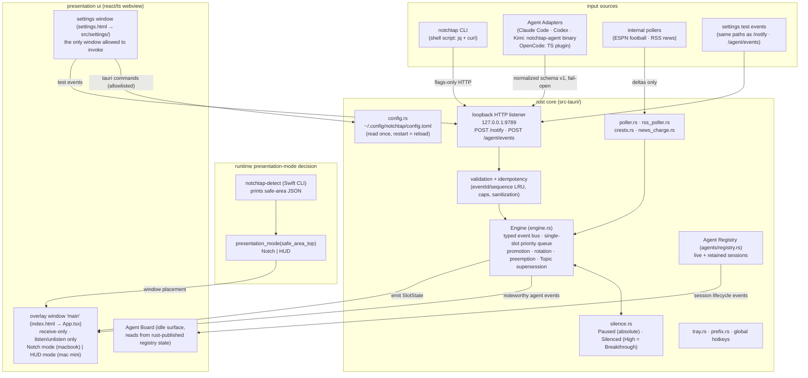

# notchtap

a macOS-only background utility that shows animated, notch-anchored (or
HUD-style, on non-notch machines) push notifications, fed by a local CLI
/ HTTP endpoint.

built for two machines: a MacBook with a notch, and a Mac mini without
one. same codebase runs unmodified on both — only window placement
branches at runtime.

## what it does

- runs permanently as a menu-bar app (no dock icon)
- a **single visible slot**: at most one notification on screen at a
  time, permanently rotating — not a stacked queue
- accepts pushes from four sources: the `notchtap` cli, the Agent
  Adapter layer (Claude Code / Codex / Kimi / OpenCode lifecycle hooks,
  including "agent needs input" alerts), an ESPN live-football poller,
  and an rss news poller
- each source has a configurable Priority (`Low`/`Medium`/`High`);
  within a tier, a configurable Rotation Order breaks ties ahead of
  plain arrival order
- an idle **Agent Board** shows live coding-agent sessions when nothing
  is promoted; a hoverable **icon strip** lets you pull any live
  source's current state on demand
- news items render as overlay cards and are overlay-only — never
  relayed outbound
- a settings window (opened from the tray) edits config; saving
  relaunches the app — there's no hot-reload
- daily Silent Period + tray timed mutes quiet Medium/Low cards while
  High still breaks through
- wraps long-running commands and pushes a completion card when they
  finish: `notchtap run -- pnpm build` (skips the push for fast,
  successful runs; a failure always pushes)

### global hotkeys

OS-level global grabs — they work even when notchtap isn't focused:

| shortcut | action |
|---|---|
| ⌃⇧N | toggle expand on the visible notification |
| ⌃⇧O | open the story/link for the visible item (news only) |
| ⌃⇧X | dismiss the visible item now |
| ⌃⇧P | toggle pause (stop/resume promotion) |
| ⌃⇧A | open/focus the highest-ranked Agent Session's Host app |
| ⌃⇧] | skip the visible item (re-queues a Recurring one) |
| ⌃⇧, | open the settings window |

a tmux-style **prefix** exists alongside these, not instead of them.
press the prefix (default `⌃⇧Space`, configurable in Settings), then
one key within 2 seconds:

| after the prefix | action |
|---|---|
| a digit | select a source tab — agent / football / news (same key again deselects) |
| `[` / `]` | previous / next agent session (agent tab only) |
| `enter` / `o` | expand ↔ collapse the current card |
| `p` | pause/resume |
| `esc` or the prefix again | disarm, no side effect |

## architecture

one rust core owns everything — the loopback HTTP listener, the
single-slot priority queue, the Agent Registry, window positioning —
and the webview renders only what rust publishes. the overlay window is
receive-only (it listens, never invokes); the settings window is the
one invoke surface, gated by a build-time command allowlist.



more diagrams — the queue model, the ipc trust boundaries, agent
integration, and the frontend composition — live in
[`docs/diagrams/architecture.md`](docs/diagrams/architecture.md)
(mermaid source; previews in VS Code/Zed with a mermaid extension and
on GitHub).

## tech stack

- **core**: Rust (Tauri) — HTTP listener, event bus, notification queue
- **UI**: React + TypeScript — rendering and animation
- **native shim**: tiny Swift CLI (`notchtap-detect`) for notch geometry
- **testing**: `cargo test` (Rust) + `vitest` (OpenCode adapter); frontend verification is manual

see [`docs/ARCHITECTURE.md`](docs/ARCHITECTURE.md) for the rationale on
every decision (why Tauri over Electron, why no App Store, etc.).

## quick start

```bash
npm install             # install dependencies
npm run tauri dev       # dev mode
cargo test              # from src-tauri/
npx vitest run adapters/opencode/notchtap.test.ts
notchtap --title "hello" --body "world"   # flags only, no positional form
```

or use the [`justfile`](justfile): `just setup` installs web deps on a
fresh clone, and `just test-all` runs every check CI runs in one
command — `brew install just` first.

## setup

- rust toolchain via [`rustup`](https://rustup.rs)
- build the notch-detection helper and symlink it where the app expects
  it (or point `detect_path` in config at it):
  ```bash
  swift build -c release   # from notchtap-detect/
  ln -s "$(pwd)/.build/release/notchtap-detect" /usr/local/bin/notchtap-detect
  ```
- `brew install jq` — the `notchtap` cli script needs `jq` and `curl`
- optionally symlink the `notchtap` script somewhere on your `PATH`
- first run: if `~/.config/notchtap/config.toml` is absent, the app
  runs with all defaults and never creates the file — only a
  settings-window save creates it
- logs: `~/Library/Logs/notchtap/notchtap.log` (10 MB × 3 rotation)

## project docs

| doc | purpose |
|---|---|
| [`docs/ARCHITECTURE.md`](docs/ARCHITECTURE.md) | locked decisions: scope, stack, cross-device behavior, IPC security, agent adapter contract |
| [`docs/TESTING_STRATEGY.md`](docs/TESTING_STRATEGY.md) | what gets automated vs. manual, framework choices, the hardware checklist |
| [`docs/GLOSSARY.md`](docs/GLOSSARY.md) | domain glossary: the product's terms, one definition each |
| [`docs/recipes/kuma-webhook.md`](docs/recipes/kuma-webhook.md) | recipe: wiring an Uptime Kuma webhook into notchtap's `/notify` endpoint |
| [`AGENTS.md`](AGENTS.md) | canonical repository guidance |

## scope

- **macOS only** — no Windows/Linux target, ever
- **personal use** — the author's own two machines, no App Store
- **clean-room build** — no code, IP, or branding from any third-party
  reference app
