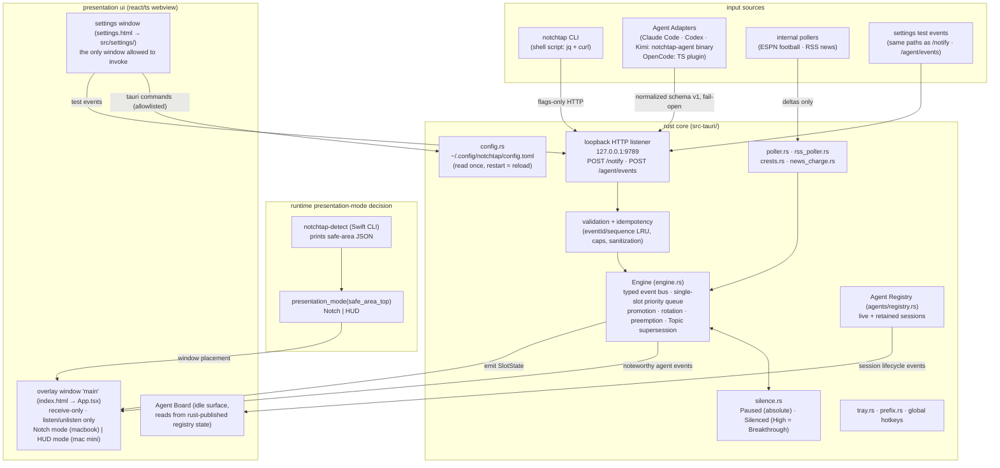
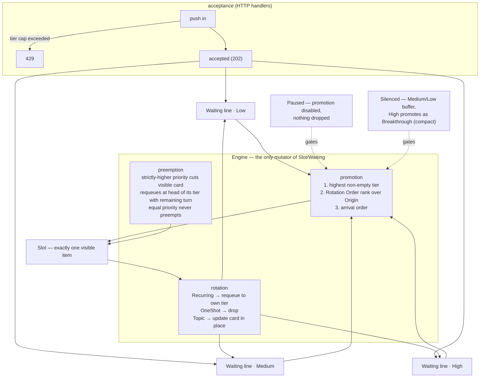
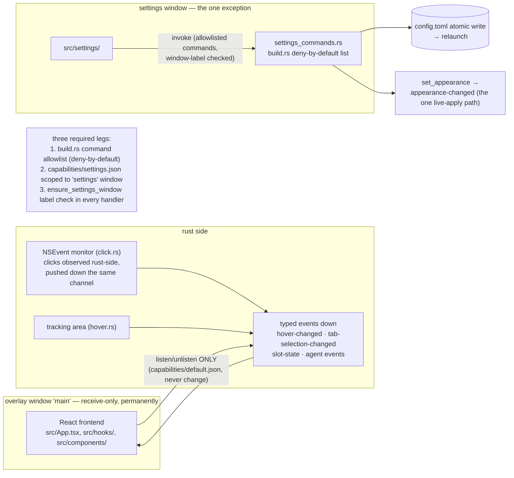
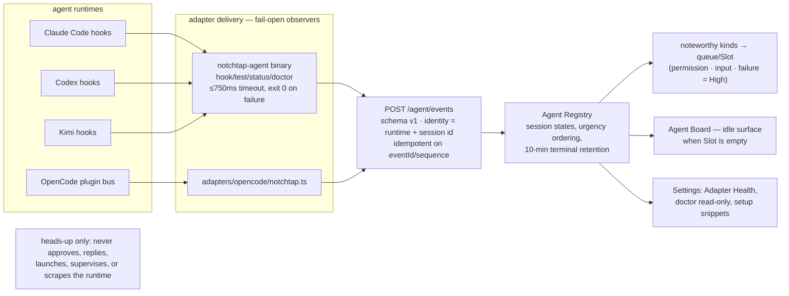
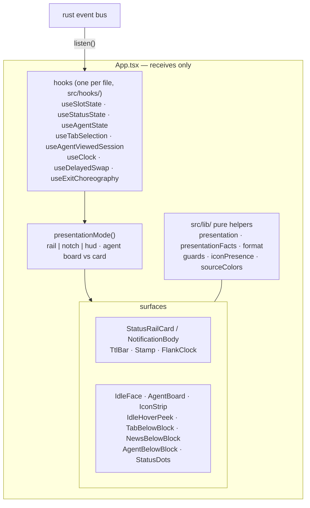
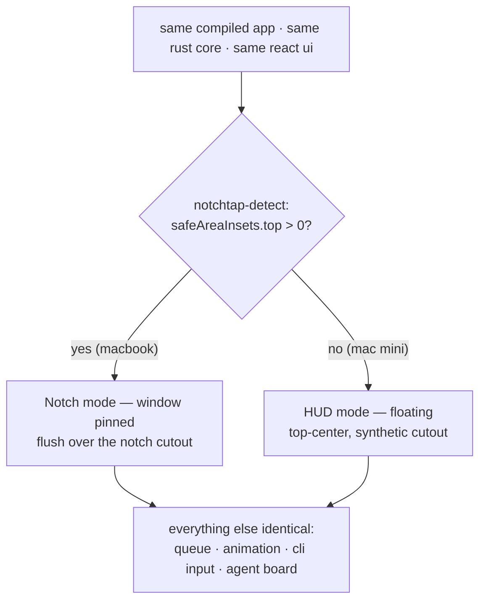

# notchtap architecture diagrams

Rendered from `docs/ARCHITECTURE.md` (§ references below). Mermaid source —
previews in VS Code (`bierner.markdown-mermaid`), Zed (any Mermaid preview
extension), and directly on GitHub. draw.io can import Mermaid via
Extras → Edit Diagram → Insert → Mermaid if a drawn/edited version is needed.

## 1. system overview (§1)

## 2. queue model — single slot, priority tiers, rotation (§6–7)

## 3. ipc & security model — two windows, two trust levels (§9)

## 4. agent integration (§10)

## 5. frontend composition (overlay)

## 6. cross-device behaviour (§2–3)

